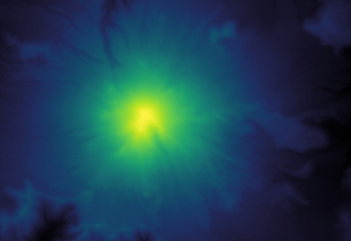
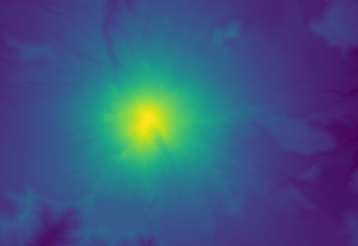
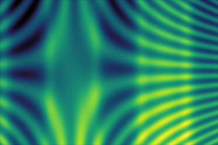

# wide-viridis

A colormap inspired by [matplotlib's viridis](https://matplotlib.org/users/colormaps.html),
but with a wider luminance range (i.e. starting at near black).

|                  | Full color                             | Grayscale                              |
| ---------------- | -------------------------------------- | -------------------------------------- |
| **Wide Viridis** |  |  |
| **Viridis**      |       |       |

Viridis is a popular choice among Matplotlib's perceptually uniform color maps
(which also include also Magma, Inferno and Plasma)
but, like Plasma, it doesn't start at black, which may be undesirable in some cases.

After unsuccessful searches for existing Viridis variants with this property,
I took it upon myself to build such a colormap.
I installed [viscm](https://github.com/matplotlib/viscm) and played with the parameters
until I managed to approximate the tonal appearance of Viridis
while making the scale start at near zero luminance.

Here are some the test images used by `viscm`, for comparison:

| Wide Viridis                       | Viridis                       |
|:----------------------------------:|:-----------------------------:|
|  |  |
|  |  |
